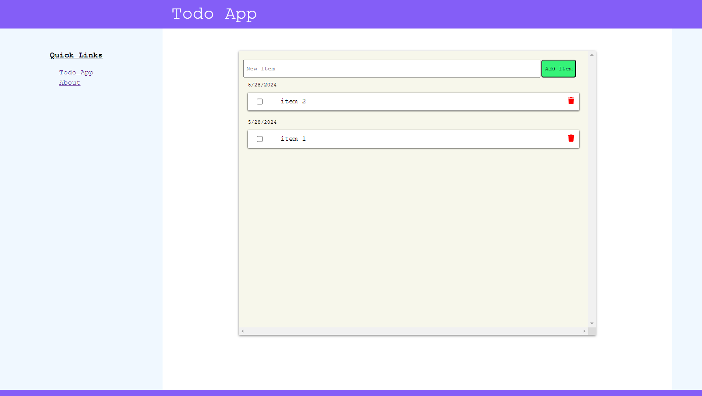

# Todo app with devops tools
## Tools used:
- docker & docker-compose 
- node.js/react UI
- node.js/express server
- mongodb & mongo-express
---

## For local development:

**To start app run:**  
```
  cd todo-app
  docker compose up
```
- React UI at: [http://localhost:3000]   
- Node.js server at: [http://localhost:2000]   
- View db at: [http://localhost:1001] 

**To stop app run:**    
```
  cd todo-app
  docker compose down
```

# collapsible
<details>
  <summary>Jenkins notes (unrelated)</summary>
  ```
  docker run --name jenkins --restart=on-failure -d \
    --network jenkins --env DOCKER_HOST=tcp://docker:2376 \
    --env DOCKER_CERT_PATH=~/Documents/cert/ \
    --publish 8080:8080 --publish 50000:50000 \
    --volume jenkins_home:/var/jenkins_home \
    --volume jenkins-certs:/certs/client:ro \
    --volume /var/run/docker.sock:/var/run/docker.sock \
    jenkins/jenkins:latest
  ```
</details>


